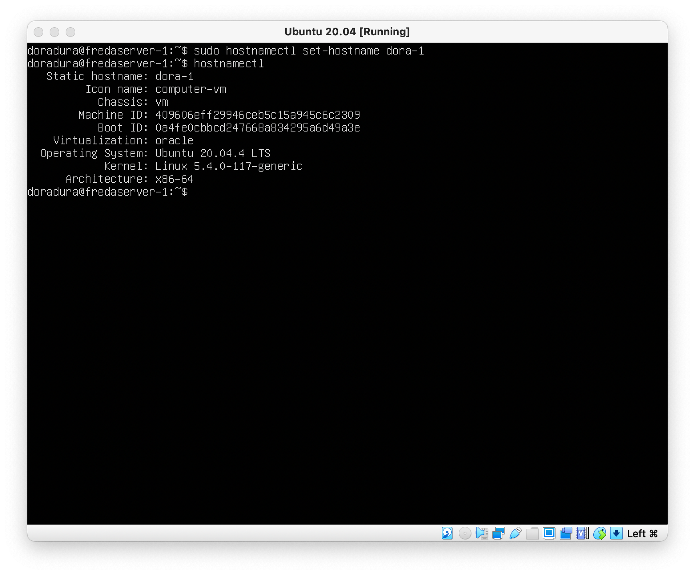
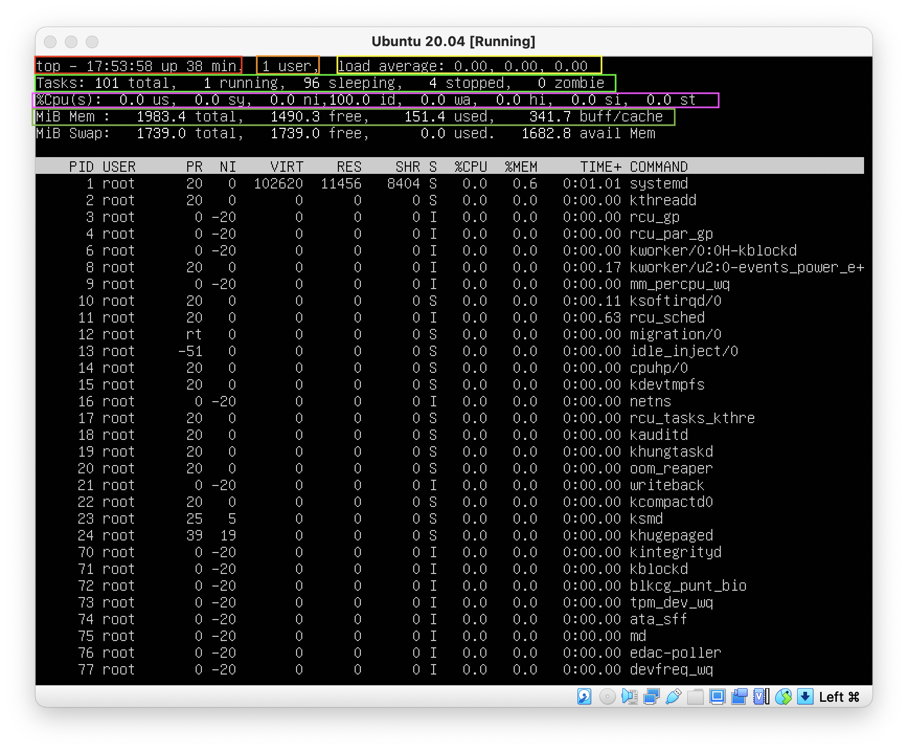
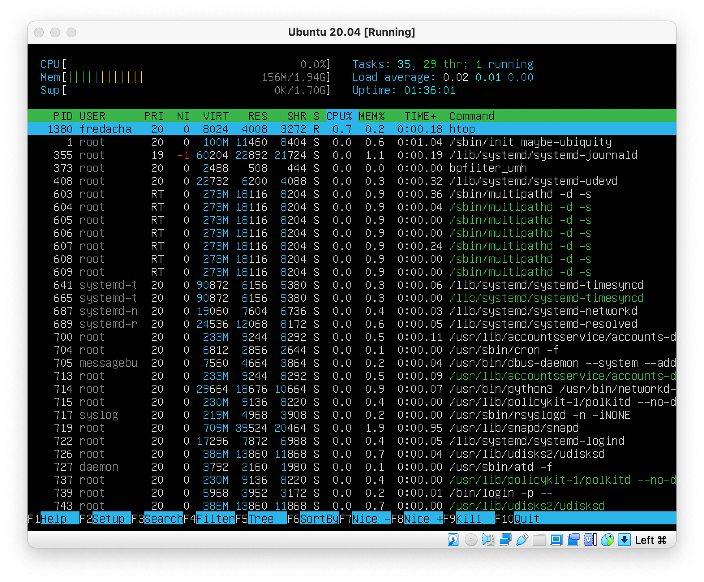
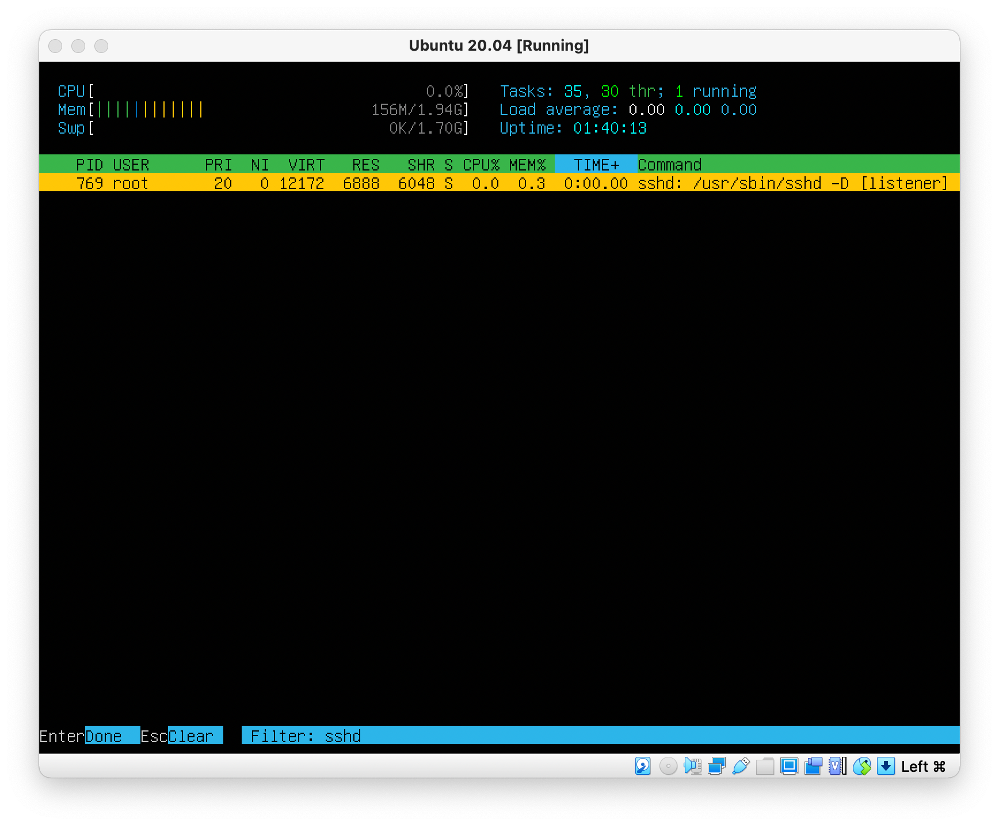

## Installing OS

### Ubuntu version

    Command running
---

## User create

### User create command call

    sudo adduser work

### Passwd output

    cat /etc/passwd output
---

## Network configuration

### Set machine name

- Using the _hostnamectl_ utility and the _set-hostname_ command, we change the name of the server

### Set time zone

- Using the _timedatectl_ utility and command _set-timezone Europe/Moscow_ we change system timezone to the Moscow location

### Showing network interfaces

- Using the _ifconfig_ command we show all network interfaces. But before using this command you will need to install _net-tools_ package via command _sudo apt install net-tools_

- Loopback is a communication channel with a single endpoint. Any messages sent to this channel are immediately received by the same channel. Any messages that are sent from this interface, but whose address is not Loopback Interface, are discarded. In computers, such a loopback interface address is the address 127.0.0.1, it is fixed and cannot be changed. On Unix-like systems, the loopback interface is called lo or lo0

### Showing DHCP

- Using command _sudo dhclient -v_ we show DHCP logs information

- Using command _less /var/lib/dhcp/dhclient.leases_ we show information from dhclient

### Getting external and internal IP

- External IP gets via command _curl https://ipinfo.io/ip_

- Internal IP gets via command _nslookup localhost_

### Configuring static adresses

- From .yaml file we can congigure static network settings

- After changing .yaml file needs apply this config via command _sudo netplan apply_

- IP config after apply settings:

### Pinging

- Ping 1.1.1.1 

- Ping ya.ru

## Update OS

- For update information of installed packages needs run command _sudo apt update_

- For install updated packages needs run command _sudo apt upgrade_

- If you installed all updated packages run command _apt list --upgradable_ for check upgradable objects. If all packages are upgraded, you will see this message

## Using the sudo command

- _sudo_ is a command-line program that allows trusted users to execute commands as root or another user

- For got the sudo permissions you will run command _usermod -aG sudo %username%_
- Changing hostname as new sudo user

## Installing and configuring timezone

- Current time

- Enabling synchronization via command _sudo timedatectl set-ntp on_

## Installing and using text editors

    sudo apt install neovim
    sudo apt install nano
    sudo apt install mcedit

> For exit with and save changes used hotkey comman :wq

> For save changes use command ^O and command ^X for exit

> For save changes use a hotkey F2 and hotkey F10 for exit

> For exit without changes use command :q!

> For exit without changes use command ^X + n

> For exit without changes use a hotkey Fn + F10 and choose "No"

> Vim seacrh result

> Vim word replace

> Nano search result

> Nano replace result

> Mcedit search result

> Mcedit replace result

## Installing and setup SSHD

- To install SSH using command _sudo apt-get install openssh-server_
- To enable ssh on boot using command _sudo systemctl enable ssh_

- To change ssh port using command _sudo vim /etc/ssh/sshd_config_

- _ps -aux | grep sshd_
- `a` this option causes ps to list all processes with a terminal (tty), or to list all processes when used together with the x option.
- `u` Display user-oriented format.
- `x` this option causes ps to list all processes owned by you (same EUID as ps), or to list all processes when used together with the a option.

- _netstat -tan output_

- `t` (`--tcp`) tcp protocol output
- `a` (`--all`) Show both listening and non-listening sockets 
- `n` (`--numeric`) Show numerical addresses instead of trying to determine symbolic host, port or user names Proto - the protocol (tcp, udp, raw) used by the socket.

## Installing and using top/htop utilities

### Top

- The `top` utility provides a dynamic real-time view of a running system.

    `uptime`
    `number of authorized user`
    `total system load`\
    `total number of proccess`
    `total cpu usage`
    `memory usage`

    `process sorted by cpu usage`

    `process sorted by memory usage`

### Htop

- PID

- %CPU

- %MEM

- TIME

- SSHD

- SYSLOG

- For output hostname, clock and uptime needs add this ouputs in settings

## Using fdisk utility

    `disk name`
    `disk size`
    `count of sectors`

- To show swap info use command _free -h_

## Using df command

- Measurement unit is KB

    `partintion size`
    `space used`
    `space free`
    `percentage used`

`partition type`
`partintion size`
`space used`
`space free`
`percentage used`

## Using du utility

- `h` using for humanreadable output
- `d` for contol depth output

## Using ncdu utility

## Working with system logs

- dmesg

- syslog

- auth.log

`last login`

- To restart ssh service uses command _sudo systemctl restart ssh.service_

## Using the CRON job scheduler

- _vim crontab -e_

